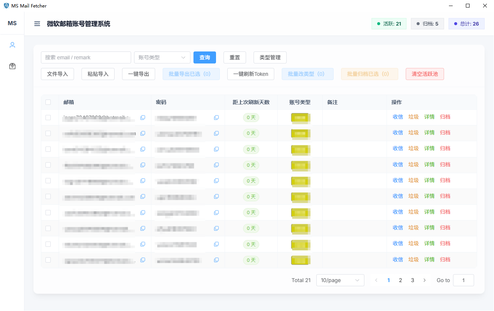
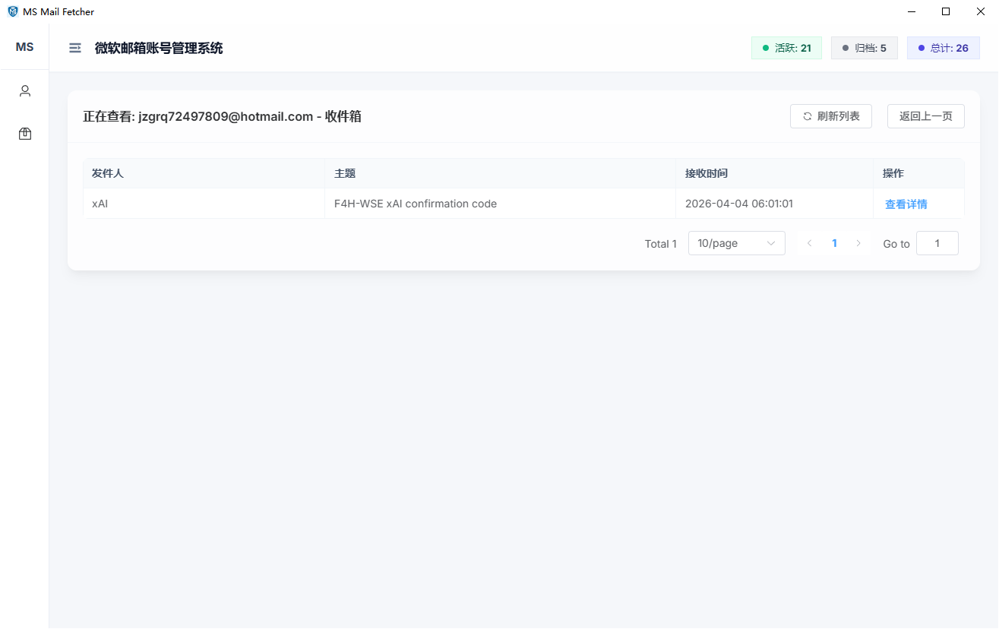
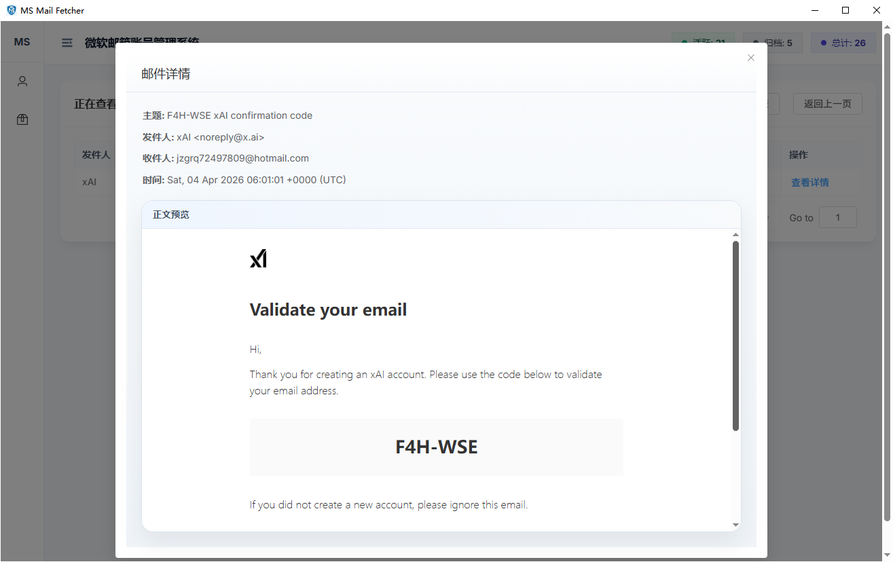
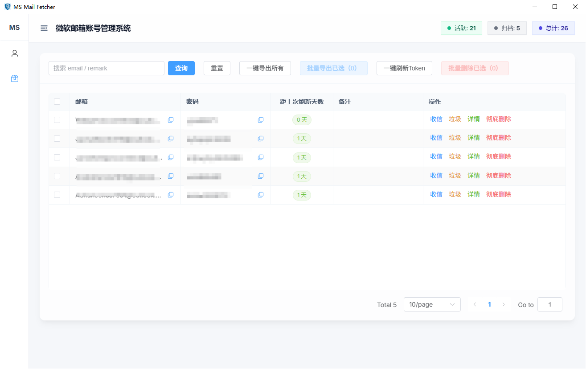

# MS Mail Fetcher

一个基于 **FastAPI + Vue 3 + pywebview** 的 Outlook 邮件账号管理与邮件查看工具，支持：

- Web 前后端分离开发
- Windows 桌面版运行与一键打包分发
- SQLite 本地持久化存储
- 账号分组、归档、批量操作、邮件读取

---

## 界面展示






---

## 1. 项目结构

```text
ms-mail-fetcher/
├─ build_desktop.bat                     # Windows 一键构建（前端构建 + 桌面打包）
├─ ms-mail-fetcher-server/               # 后端服务（FastAPI）
│  ├─ app.py                             # 后端 API 启动入口
│  ├─ server.config.json                 # 后端运行配置
│  ├─ requirements.txt                   # 后端 Python 依赖
│  ├─ app/                               # FastAPI 业务代码
│  └─ docs/                              # 文档与数据库说明
├─ ms-mail-fetcher-desktop/              # 桌面端入口与打包配置
│  ├─ desktop_main.py                    # 桌面版启动入口
│  ├─ ms-mail-fetcher-desktop.spec       # PyInstaller 打包配置
│  ├─ app.ico                            # 桌面图标
│  ├─ server.config.json                 # 桌面端运行配置
│  ├─ requirements.txt                   # 桌面端 Python 依赖
│  ├─ template/                          # 前端构建产物目录
│  └─ README_DESKTOP_PACKAGING.md        # 桌面打包说明
├─ ms-mail-fetcher-web/                  # Vue 3 + Vite 前端
│  ├─ src/
│  ├─ package.json
│  └─ vite.config.js
└─ screenshots/                          # 项目截图
```

---

## 2. 技术栈

### 后端
- Python 3.10+
- FastAPI
- Uvicorn
- SQLAlchemy
- Pydantic
- Requests

### 前端
- Vue 3
- Vite
- Element Plus
- Axios
- Vue Router

### 桌面端
- pywebview
- PyInstaller
- WebView2 Runtime（Windows 推荐安装）

---

## 3. 环境要求

### 必需环境
- Python 3.10+
- Node.js 20+
- npm 10+

### 推荐环境
- Windows 10/11
- 已安装 WebView2 Runtime

---

## 4. 快速开始（开发模式）

### 4.1 启动后端 API

```bash
pip install -r ms-mail-fetcher-server/requirements.txt
python ms-mail-fetcher-server/app.py
```

默认读取 `ms-mail-fetcher-server/server.config.json`，可自动处理端口占用（若开启 `auto_port_fallback`）。

### 4.2 启动前端开发服务器

```bash
cd ms-mail-fetcher-web
npm install
npm run dev
```

---

## 5. 桌面端运行与打包（Windows）

### 5.1 本地运行桌面端

```bash
pip install -r ms-mail-fetcher-desktop/requirements.txt
python ms-mail-fetcher-desktop/desktop_main.py
```

运行时会：
- 启动内嵌 FastAPI 服务
- 自动选择可用本地端口
- 打开 pywebview 桌面窗口

### 5.2 一键打包（推荐）

在仓库根目录执行：

```bash
build_desktop.bat
```

脚本流程：
1. 构建前端 `ms-mail-fetcher-web/dist`
2. 将前端构建产物同步到 `ms-mail-fetcher-desktop/template`
3. 清理旧的构建产物
4. 执行 PyInstaller 打包

产物位置：
- `ms-mail-fetcher-desktop/dist/ms-mail-fetcher/ms-mail-fetcher.exe`

### 5.3 手动打包

```bash
cd ms-mail-fetcher-desktop
python -m PyInstaller --clean ms-mail-fetcher-desktop.spec
```

---

## 6. 运行配置

后端默认配置文件：`ms-mail-fetcher-server/server.config.json`

桌面端默认配置文件：`ms-mail-fetcher-desktop/server.config.json`

示例：

```json
{
  "host": "0.0.0.0",
  "port": 18765,
  "reload": false,
  "auto_port_fallback": true,
  "port_retry_count": 20
}
```

字段说明：
- `host`：绑定地址
- `port`：首选端口
- `reload`：开发热重载（仅开发模式使用）
- `auto_port_fallback`：端口被占用时自动尝试后续端口
- `port_retry_count`：最大重试端口数量

---

## 7. 数据存储

应用使用 SQLite，本地数据默认保存在：

- `%LOCALAPPDATA%/ms-mail-fetcher/ms_mail_fetcher.db`
- `%LOCALAPPDATA%/ms-mail-fetcher/ui_preferences.json`
- `%LOCALAPPDATA%/ms-mail-fetcher/webview2/`

如果系统环境中没有 `LOCALAPPDATA`，会回退到用户目录下的本地数据路径。

主要数据表：
- `accounts`
- `account_types`

详细结构参考：`ms-mail-fetcher-server/docs/sqlite-schema.md`

---

## 8. 主要 API 路由

- `GET /api/health`
- `GET /api/accounts`
- `POST /api/accounts`
- `PUT /api/accounts/archive-all`
- `POST /api/accounts/import`
- `GET /api/accounts/export`
- `PUT /api/accounts/{account_id}/archive`
- `PUT /api/accounts/refresh-all-tokens`
- `PUT /api/accounts/{account_id}`
- `DELETE /api/accounts/{account_id}`
- `GET /api/account-types`
- `POST /api/account-types`
- `PUT /api/account-types/{account_type_id}`
- `DELETE /api/account-types/{account_type_id}`
- `GET /api/accounts/{account_id}/mail/{folder}`
- `GET /api/accounts/{account_id}/mail/{folder}/{message_id}`
- `GET /api/ui/preferences`
- `PUT /api/ui/preferences`

---

## 9. Git 忽略建议

建议在仓库根目录的 `.gitignore` 中忽略：

- `.vscode/`
- `ms-mail-fetcher-server/build/`
- `ms-mail-fetcher-server/dist/`
- `ms-mail-fetcher-desktop/build/`
- `ms-mail-fetcher-desktop/dist/`
- `ms-mail-fetcher-web/node_modules/`
- `ms-mail-fetcher-web/dist/`
- `__pycache__/`
- `*.db`
- `.env*`（保留示例文件即可）

---

## 10. 常见问题

### Q1：前端页面空白或 404
请先执行前端构建，并确认 `ms-mail-fetcher-desktop/template/index.html` 或对应静态资源已生成。

### Q2：端口被占用
检查 `server.config.json` 中是否开启 `auto_port_fallback`，或手动修改 `port`。

### Q3：桌面包无法覆盖旧版本
先关闭正在运行的 `ms-mail-fetcher.exe`，再重新执行 `build_desktop.bat`。

### Q4：能否打包 macOS 版本
可以尝试，但建议在 macOS 环境中执行打包；通常不建议直接在 Windows 上跨平台产出 `.app`。

---

## 11. 维护建议

- 每次发布前执行一次完整的桌面构建验证
- 定期备份 SQLite 文件与 UI 偏好文件
- 敏感配置建议使用环境变量或本地私有配置文件管理
- 打包前确认前端构建产物已同步到桌面端 `template` 目录

---

## 12. License

如需开源发布，请在仓库根目录补充 `LICENSE` 文件，并在此处声明许可证类型。

---

## 13. Link

[Linux do](https://linux.do/) - 学 AI，上 L 站！真诚、友善、团结、专业，共建你我引以为荣之社区。
